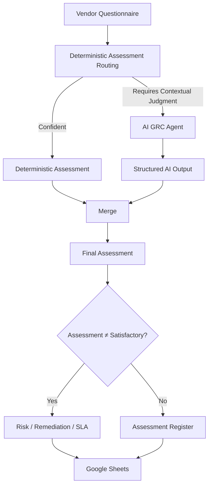

# Automated Third-Party Security Assessment

A hybrid GRC automation workflow built with n8n and agentic AI to automate third-party security control assessments.

## Overview

The workflow processes vendor security questionnaires and combines deterministic assessment logic with AI-assisted analysis for controls requiring contextual judgment.

## Architecture

## Key Features

- Hybrid deterministic + AI assessment
- Methodology-driven GRC analysis
- Evidence sufficiency evaluation
- Control gap identification
- Risk classification
- Remediation recommendations
- Remediation SLA generation
- Assessment source traceability
- Structured assessment register

## Technology

- n8n
- Agentic AI
- OpenAI
- Google Sheets
- JavaScript
- CSV

## Assessment Methodology

The workflow classifies controls as:

- Satisfactory
- Partially Implemented
- Insufficient Evidence
- Non-Compliant

AI is used only for controls that require contextual assessment beyond deterministic logic.

## Project Structure

workflow/      n8n workflow
prompts/       AI assessment methodology
sample-data/   Sanitized questionnaire
docs/          Architecture documentation
